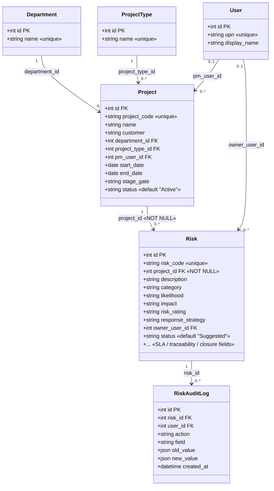
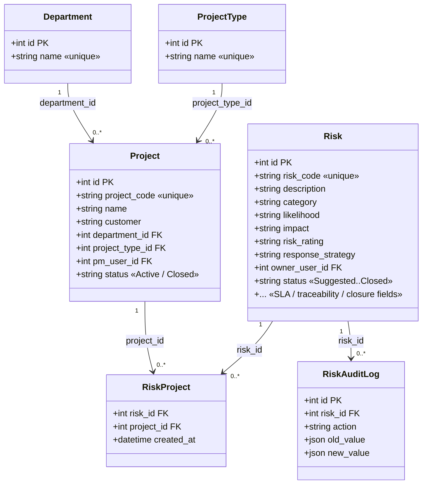

# #15 — Risk ⇄ Project Normalization — UML Data Model Diagrams

> **Status:** PLANNING ONLY — nothing implemented.
> **Companion to:** `Issues/15-risk-project-normalization-migration.md` (full impact
> assessment & migration plan).
> **Date:** 2026-09-02
>
> These UML class diagrams (Mermaid syntax) illustrate the **current** data model
> and the **target** data model for normalizing the `Risk → Project` relationship
> into a `Risk ↔ Risk_Project ↔ Project` junction model.

---

## 1. Current Data Model

**Key point:** `Risk` holds a required `project_id` FK directly. A risk cannot
exist without exactly one project. The relationship is strictly
**one Project → many Risk**.

---

## 2. Target Data Model

**Key point:** `project_id` is removed from `Risk`. The association now lives in
the `RiskProject` junction table. A risk can exist **independently** and be
associated with project(s) through `RiskProject`.

---

## 3. Side-by-Side of the Change

| | Current | Target |
|---|---|---|
| Association lives in | `Risk.project_id` (FK column) | `RiskProject` (junction table) |
| Risk can exist without project? | **No** (NOT NULL FK) | **Yes** |
| Cardinality | Project `1 — *` Risk (one-to-many) | Project `1 — *` RiskProject `* — 1` Risk (many-to-many) |
| What's new | — | `RiskProject` table |
| What's removed | — | `Risk.project_id` |

> ⚠️ **Open question** (from §17 of the companion doc): the junction diagram
> implies **many-to-many**. If the intent is actually "one risk → one project, just
> normalized," constrain the `RiskProject` relationship to `1..1` on the risk side
> (unique `risk_id`) rather than `0..*`.
