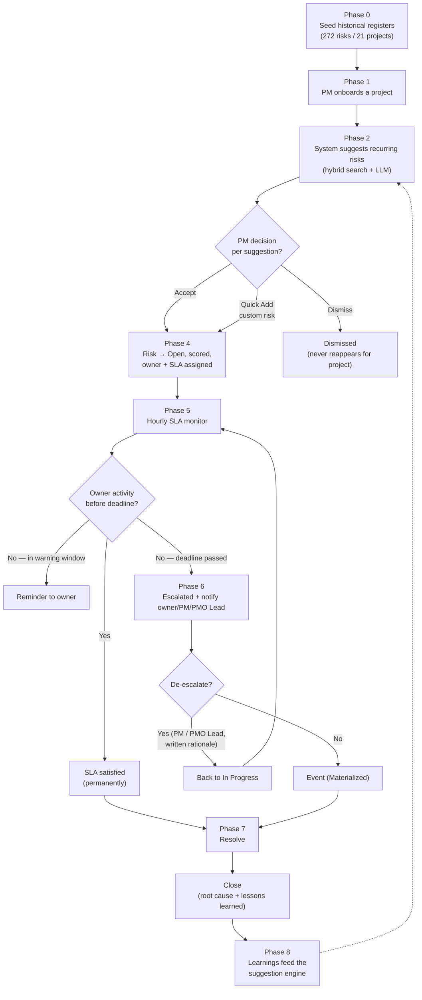
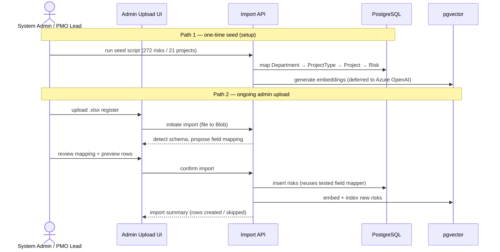
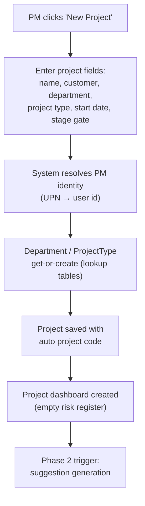
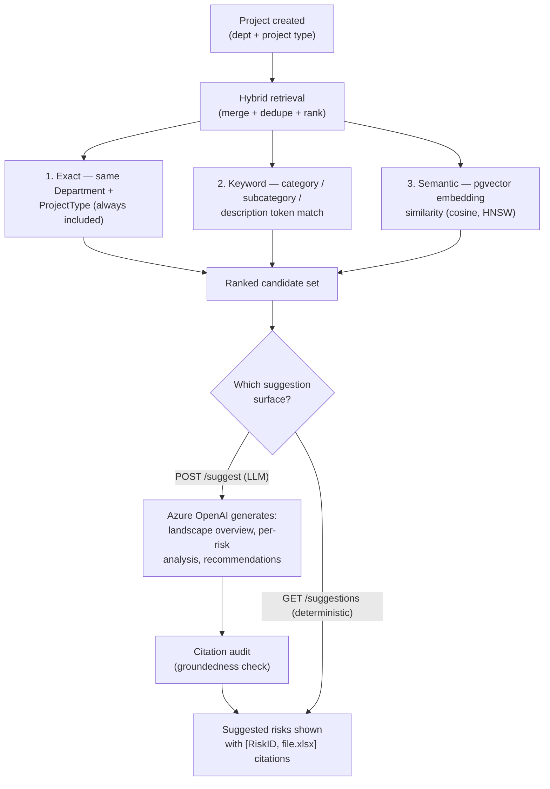
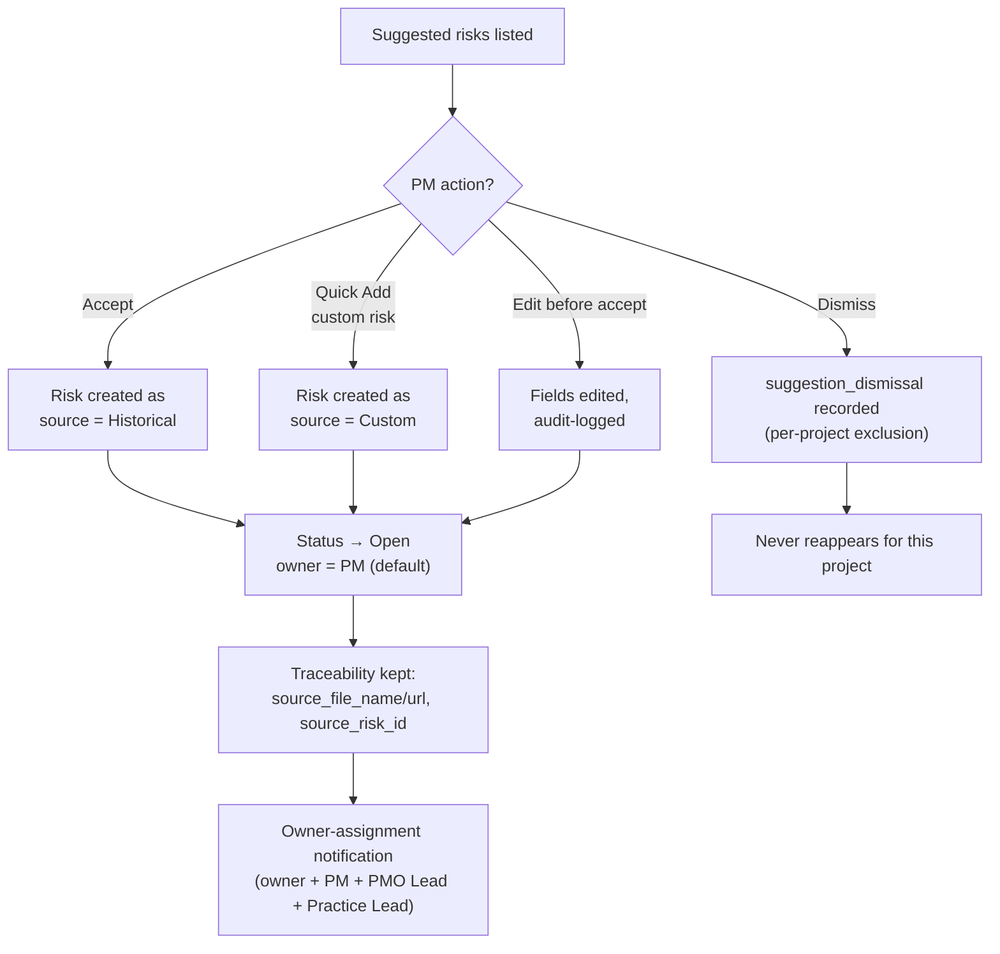
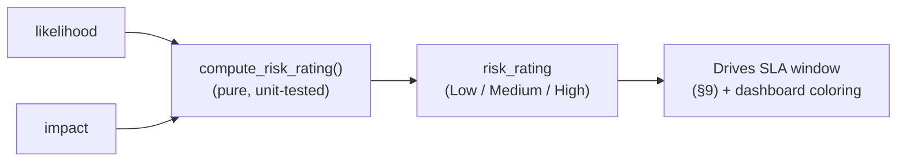
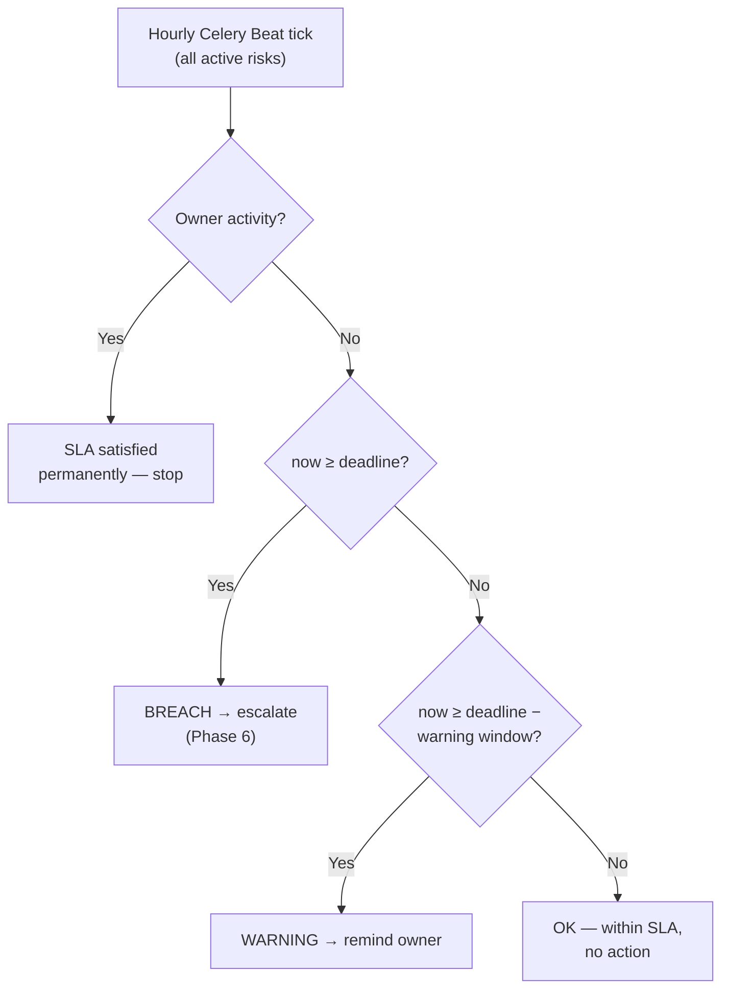
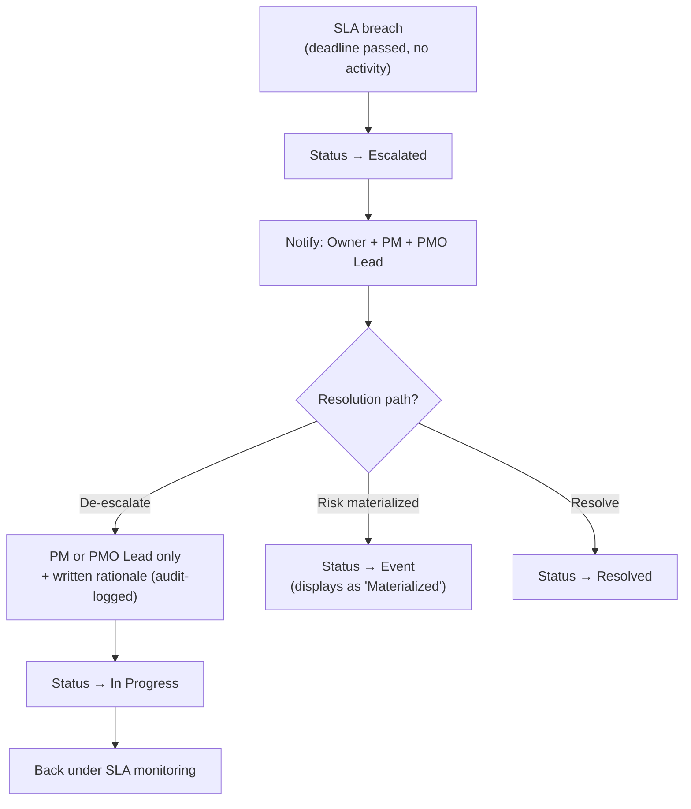
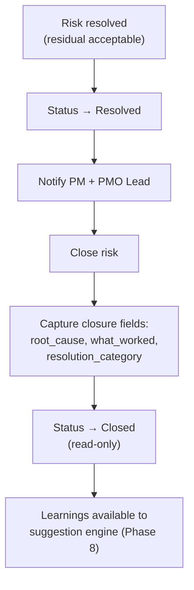
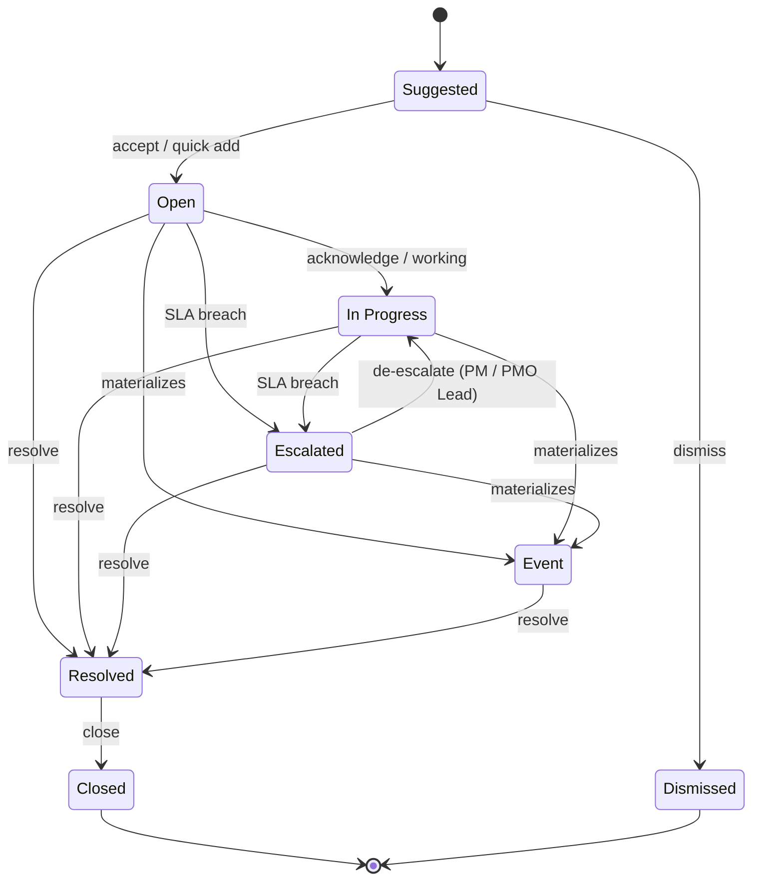

# PMO Risk Recurrence Predictor — End-to-End Process Flow

> Authoritative process-flow reference. Complements `SPEC.md` (product decisions),
> `ARCHITECTURE.md` (how the system is built), and `README.md` (quickstart).
> This document traces *what happens, in what order, and who does it* — from the
> moment historical data lands in the system to a risk being closed and its
> learnings feeding the next project.

All diagrams are [Mermaid](https://mermaid.js.org) and render on GitHub, VS Code,
and most Markdown viewers.

---

## 1. Scope & reading guide

This document describes the **runtime business process** of the application (not
the development/build process, which lives in `SPEC.md` §13 and `Issues/`).

The end-to-end flow is a **closed loop** with eight phases:

| # | Phase | Entry trigger | Primary actor(s) |
|---|---|---|---|
| 0 | Historical data ingestion | System setup | System Admin |
| 1 | Project onboarding | PM creates a project | Project Manager |
| 2 | Risk suggestion ("recurrence") | Project created | System (LLM + retrieval) |
| 3 | Risk capture | Suggestions returned | PM / Risk Owner |
| 4 | Scoring | Risk accepted / created | System (deterministic) |
| 5 | SLA monitoring | Risk has a deadline | System (Celery Beat) |
| 6 | Escalation | SLA breach | System → PMO Lead |
| 7 | Resolution & closure | Owner resolves | Owner / PM |
| 8 | Learning feedback | Risk closed | System |

---

## 2. Actors & roles

| Actor | Type | What they do |
|---|---|---|
| **System Admin** | Permission role | Manage users, config, imports; see all data. |
| **PMO Lead** | Permission role | Portfolio view, handle escalations, de-escalate, settings, import. |
| **Project Manager (PM)** | Permission role | Create projects; full control of *own* projects' risks. |
| **Risk Owner** | Record-level | Per-risk assignee; edits own risks; receives SLA warnings. |
| **Practice Lead** | Record-level | Department → person; CC'd on owner-assignment notifications. |
| **System** | Automation | Celery scheduler, SLA monitor, LLM suggestion engine, notifier. |

Row-level scoping (enforced in the API layer):

- PM sees/edits **only their own projects'** risks.
- Owner edits **only their assigned** risks.
- PMO Lead / Admin see **everything**.

---

## 3. High-level end-to-end overview



**The loop matters:** closing a risk captures `root_cause`, `what_worked`, and
`resolution_category`, which enrich the historical corpus so future suggestions
improve. This is what makes it a *recurrence* predictor rather than a one-shot
register.

---

## 4. Phase 0 — Historical data ingestion

Two paths populate the historical corpus:

1. **One-time seed** (setup): the ported import pipeline
   (`excel_parser.py → field_mapper.py → importer.py`) loads ~272 historical
   risks across 21 projects from the existing risk registers.
2. **Admin upload UI** (ongoing): PMO Lead / System Admin uploads `.xlsx`,
   maps fields, previews, and imports.



**Field mapping note:** legacy Low/Med/High text maps straight through
(provisional); the same tested `field_mapper` powers both paths.

---

## 5. Phase 1 — Project onboarding



- The PM is the project's **default owner** for any risk accepted without an
  explicit assignee.
- Department and Project Type are **lookup tables** (~20 types), not enums —
  they grow as new engagements arrive.
- A project implicitly owns a risk register; every risk hangs off the project.

---

## 6. Phase 2 — Risk suggestion ("recurrence")

On project creation, the system retrieves candidate historical risks via **full
hybrid search**, then optionally runs LLM analysis with **grounded citations**.



**Two suggestion surfaces** (both feed the accept/dismiss UI):

- `GET  /api/projects/{id}/suggestions` — **deterministic** exact + keyword
  list, no LLM/embeddings. This is what the onboard → accept/dismiss flow uses.
- `POST /api/projects/{id}/suggest` — full LLM analysis (requires Azure OpenAI).

**Citation safety:** every `[RiskID, file.xlsx]` citation is **audited against
the retrieved payload** before display. The LLM cannot cite a risk that was not
actually retrieved — a groundedness check rejects any hallucinated reference.

---

## 7. Phase 3 — Risk capture (accept / dismiss / quick add)



- **Accept** creates an `Open` risk carrying traceability back to the original
  register file and row.
- **Dismiss** writes a per-project exclusion (`suggestion_dismissal`) so the
  same suggestion never resurfaces for that project.
- **Quick Add** lets a PM capture a brand-new risk not in the historical corpus.

---

## 8. Phase 4 — Scoring

Scoring is **pure and deterministic**: `risk_rating = f(likelihood, impact)`
via the standard 3×3 matrix. No Critical band, no 1–25 score, no CIA/regulatory
dimensions.

| Likelihood ↓ / Impact → | High | Medium | Low |
|---|---|---|---|
| **High** | High | High | Medium |
| **Medium** | High | Medium | Low |
| **Low** | Medium | Low | Low |



The rating is recomputed whenever `likelihood`/`impact` change (audit-logged).

---

## 9. Phase 5 — SLA monitoring

Checked **hourly** by Celery Beat. The clock starts at `risk_start_date`
(midnight in the business timezone, default `Africa/Lagos`) or falls back to
`created_at`.

| Rating | SLA deadline | Warning window |
|---|---|---|
| High | 24 hours | 4 hours before |
| Medium | 48 hours | 12 hours before |
| Low | 120 hours (5 days) | 24 hours before |

**Activity** = any of (a) an audit-log entry by the owner (field edit / status
change / note), or (b) explicit **Acknowledge**. Once activity occurs, the SLA
is **permanently satisfied** — no further reminders.



Changing `risk_rating` or `risk_start_date` **recomputes** the deadline unless
it is manually overridden (`sla_manual_override`).

---

## 10. Phase 6 — Escalation & de-escalation

**Escalation is SLA-driven only** — no Critical flag, no score-change triggers.



- Only **PM or PMO Lead** may de-escalate, and it requires a written rationale
  recorded in the append-only audit log.
- De-escalation returns the risk to `In Progress` and re-enters monitoring.

---

## 11. Phase 7 — Resolution & closure



`Closed` is **terminal and read-only** — the audit log preserves the full
history from suggestion to closure.

---

## 12. Phase 8 — Learning feedback loop

Closed risks (root cause, what worked, resolution category) enrich the
historical corpus. The next time a project of the same Department + Project Type
is created, those learnings surface as grounded suggestions — closing the loop.

```
 historical risk → suggested → captured → monitored → escalated/resolved → closed
        ▲                                                                    │
        └──────────────── learnings feed the next project ◄────────────────┘
```

---

## 13. Status lifecycle (state machine)



| Status | Meaning |
|---|---|
| Suggested | Created by LLM suggestion or Quick Add; not yet accepted. |
| Open | Accepted and live; owner + SLA assigned; awaiting first action. |
| In Progress | Owner acknowledged / working. |
| Escalated | SLA breached (no activity before deadline). |
| Event | Risk materialised (displays as "Materialized"). |
| Resolved | Issue resolved; residual acceptable. |
| Closed | Formally closed with root cause / lessons learned; read-only. |
| Dismissed | A Suggested risk the PM rejected (never reappears for that project). |

Transitions are **enforced** — an invalid transition raises an error, and every
mutation writes an append-only `risk_audit_log` row (field / old / new / user /
timestamp / JSONB snapshot).

---

## 14. Notification matrix

| Trigger | Recipients | Channel |
|---|---|---|
| Owner assignment | Owner + PM + PMO Lead + Practice Lead (CC) | Email + in-app |
| SLA warning | Owner | Email |
| Breach / escalation | Owner + PM + PMO Lead | Email |
| Risk start date | Owner | Email + in-app |
| Weekly summary (Mon 8 AM) | PM + PMO Lead | Email |
| Closure confirmation | PM + PMO Lead | Email |

Email action buttons are **deep links** into the React app (not SharePoint
forms).

---

## 15. End-to-end happy path (swimlane)

```mermaid
sequenceDiagram
    autonumber
    actor PM as Project Manager
    actor OW as Risk Owner
    participant SYS as System (App + Celery + LLM)
    actor PL as PMO Lead

    PM->>SYS: Create project (dept + type + customer)
    SYS->>SYS: Hybrid retrieval (exact + keyword + semantic)
    SYS->>SYS: LLM analysis + citation audit
    SYS-->>PM: Suggested risks with grounded citations

    PM->>SYS: Accept suggestion (or Quick Add)
    SYS->>SYS: Status = Open, score via 3x3, assign owner + SLA
    SYS-->>OW: Owner-assignment notification (+ PM, PMO Lead, Practice Lead)

    loop Hourly (Celery Beat)
        SYS->>SYS: Check SLA (activity / warning / breach)
        alt No activity, within warning window
            SYS-->>OW: Reminder
        else Deadline passed
            SYS->>SYS: Status = Escalated
            SYS-->>OW: Breach email (owner + PM + PMO Lead)
        end
    end

    alt Escalated
        PL->>SYS: De-escalate (written rationale)
        SYS->>SYS: Status = In Progress, re-enter monitoring
    end

    OW->>SYS: Resolve (residual acceptable)
    SYS->>SYS: Status = Resolved, notify PM + PMO Lead
    PM->>SYS: Close (root cause + lessons learned)
    SYS->>SYS: Status = Closed (read-only); learnings → corpus
```

---

## 16. Edge cases & exception flows

| Case | Behaviour |
|---|---|
| **Invalid status transition** | Rejected (`InvalidTransitionError`); no override without an audit-log entry. |
| **LLM cites a risk not retrieved** | Citation audit rejects it before display (groundedness check). |
| **Risk has no `risk_start_date`** | SLA anchor falls back to `created_at`. |
| **Suggestion dismissed** | Per-project exclusion; never reappears for that project. |
| **Manual SLA override** | `sla_manual_override` freezes the deadline; rating/start-date edits don't recompute it. |
| **PM without assigned risk** | Sees only their own projects' risks; owners only their assigned risks. |
| **Dismissed/Closed status** | Terminal — no further transitions. |

---

## 17. One-page summary

1. **Ingest** historical registers (seed + admin upload).
2. **Onboard** a project (dept + type + customer).
3. **Suggest** recurring risks (exact + keyword + semantic → LLM + citation audit).
4. **Capture** — accept (Open) / dismiss (excluded) / quick add (Custom).
5. **Score** via the deterministic 3×3 matrix.
6. **Monitor** hourly; warn, then **escalate on breach**.
7. **Resolve** → **Close** with root cause + lessons learned.
8. **Feed** learnings back so the next project's suggestions improve.
